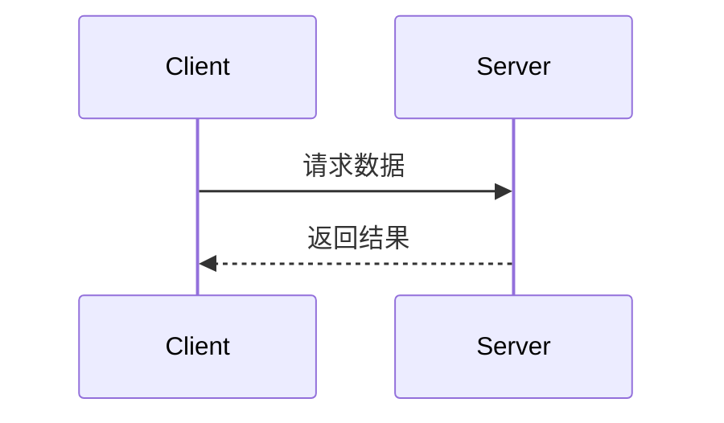

# Project Overview

This is a full-stack web application for a "Green Technology Platform". The project consists of two main parts:

1.  **Frontend:** A modern web application built with **Next.js 14** (using the App Router), **React**, and **TypeScript**. The UI is styled with **Tailwind CSS** and the **shadcn/ui** component library. It communicates with both a Java backend and Supabase.
2.  **Backend:** A Java-based backend service built with **Spring Boot 3** and **Java 17**. It provides a REST API for the platform's core business logic. It uses **Maven** for dependency management.
3.  **Database & Services:** **Supabase** is used for the database (PostgreSQL), authentication, and storage. The project is also configured to potentially connect to **Huawei Cloud RDS (MySQL)** in a production environment.

The application is containerized using **Docker**, as indicated by the presence of `Dockerfile`s.

## 技术栈
- 前端使用Next.js技术+Tailwind CSS框架 
- 移动端APP开发使用React Native 
- 尽量使用shadcn/ui现成的组件
- 使用 GitHub 作为代码托管平台
- 使用Upstash Redis作为边缘缓存服务
- 后端使用Java语言+SpringBoot框架
- 邮件服务使用Resend
- 使用Cloudflare作为CDN网络服务
- 使用Vercel进行一键部署
- 使用Open Router作为多模型AI接口
- 使用Stripe和微信支付作为安全支付服务
- 所有调用后端服务都必须使用API，目录在src/api
- 你在进行页面开发时，可以扫描 @README.md 的项目结构，查看是否有可用的组件或工具方法
- 所有调用后端服务都必须使用API，目录在src/api
- 页面的组件嵌套不要超过三层
- 你在进行页面开发时，可以扫描 [README.md](/docs/README.md) 的项目结构，看下是否有可用的组件或者工具方法

## 项目结构
- 每次更新完文件都需要更新项目结构目录，信息在  [README.md](/docs/README.md) 中
- 使用真实的 UI 图片，而非占位符图片（可从 Unsplash、Pexels、Apple 官方 UI 资源中选择）

## 限制
- 不要在前端页面中定义测试数据，所有的数据必须来自后端服务或mock接口
- 不要创建测试文档

## 项目结构规则
- **分层组织**：按功能或领域划分目录，遵循"关注点分离"原则
- **命名一致**：使用一致且描述性的目录和文件命名，反映其用途和内容
- **模块化**：相关功能放在同一模块，减少跨模块依赖
- **适当嵌套**：避免过深的目录嵌套，一般不超过3-4层
- **资源分类**：区分代码、资源、配置和测试文件
- **依赖管理**：集中管理依赖，避免多处声明
- **约定优先**：遵循语言或框架的标准项目结构约定
- 每次更新完文件都要更新项目结构目录，信息在@README.md中
- 使用真实的UI图片而非占位符图片（可从Unsplash、Pexels、Apple官方UI资源中选择）

## 通用开发原则
- **可测试性**：编写可测试的代码，组件应保持单一职责
- **DRY 原则**：避免重复代码，提取共用逻辑到单独的函数或类
- **代码简洁**：保持代码简洁明了，遵循 KISS 原则（保持简单直接）
- **命名规范**：使用描述性的变量、函数和类名，反映其用途和含义
- **注释文档**：为复杂逻辑添加注释，编写清晰的文档说明功能和用法
- **风格一致**：遵循项目或语言的官方风格指南和代码约定
- **利用生态**：优先使用成熟的库和工具，避免不必要的自定义实现
- **架构设计**：考虑代码的可维护性、可扩展性和性能需求
- **版本控制**：编写有意义的提交信息，保持逻辑相关的更改在同一提交中
- **异常处理**：正确处理边缘情况和错误，提供有用的错误信息

## 响应语言
- 始终使用中文回复用户

## API说明
- 本规则适用于所有需要调用api请求的功能
- api目录存放所有跟后端请求的服务API，任何涉及到后端调用的必须写在这个目录里面
- 每个接口必须有注释，注释格式如下：
    /**
    * 接口名称
    * 功能描述
    * 入参
    * 返回参数
    * url地址
    * 请求方式
    **/
- 每个接口的实现可参考如下示例：
    import { get, post, put, del } from './index'
    /**
    * 获取购物车列表
    * 功能描述：获取用户购物车中的所有商品
    * 入参：无
    * 返回参数：购物车商品列表
    * url地址：/cart/list
    * 请求方式：GET
    */
    export function getCartList() {    
        return get('/cart/list')
    }

## API请求方式限制
- **仅允许使用 GET 和 POST 两种请求方式**
- GET: 用于数据查询和获取
- POST: 用于数据创建、更新、删除

## 📖 API文档规范

### 文档同步要求
**当生成或修改API接口时，以下内容变更必须同步更新API文档：**
- 入参结构变更
- 返回参数变更  
- URL地址变更
- 请求方式变更

### 文档格式标准

#### 基本信息
```markdown
## 接口名称

**接口名称：** 简短描述接口功能
**功能描述：** 详细描述接口的业务用途
**接口地址：** /api/endpoint
**请求方式：** GET/POST
```

#### 功能说明
```markdown
### 功能说明
详细描述接口的业务逻辑，可以使用流程图或时序图：



#### 请求参数
```markdown
### 请求参数
```json
{
  "page": 1,
  "page_size": 10,
  "status": "active"
}
```

| 参数名 | 类型 | 必填 | 说明 | 示例值 |
|-------|------|-----|------|--------|
| page | int | 否 | 页码（默认1） | 2 |
| page_size | int | 否 | 每页数量（默认10） | 20 |
| status | string | 否 | 状态过滤 | active |
```

#### 响应参数
```markdown
### 响应参数
```json
{
  "error": 0,
  "body": {
    "user_id": 1,
    "username": "admin",
    "email": "admin@example.com",
    "status": "active"
  },
  "message": "获取用户基本信息成功",
  "success": true
}
```

| 参数名 | 类型 | 必填 | 说明 | 示例值 |
|-------|------|-----|------|--------|
| error | int | 是 | 错误码 | 0 |
| body | object | 是 | 响应数据 | |
| body.user_id | int | 是 | 用户ID | 1 |
| body.username | string | 是 | 用户名 | admin |
| body.email | string | 是 | 邮箱 | admin@example.com |
| body.status | string | 是 | 用户状态 | active |
| message | string | 是 | 响应消息 | 获取用户基本信息成功 |
| success | bool | 是 | 是否成功 | true |
```

**注意：** 如果body是对象，需要列出所有子字段，格式为 `body.字段名`


# Building and Running

## Frontend (Next.js)

First, create a `.env.local` file in the root directory with the necessary environment variables:

```env
NEXT_PUBLIC_API_URL=http://localhost:8080/api
NEXT_PUBLIC_SUPABASE_URL=your_supabase_url
NEXT_PUBLIC_SUPABASE_ANON_KEY=your_supabase_anon_key
```

Then, run the following commands:

```bash
# Install dependencies
npm install

# Run the development server
npm run dev

# Build for production
npm run build

# Start the production server
npm run start
```

## Backend (Java/Spring Boot)

The backend is a standard Maven project.

```bash
# Navigate to the backend directory
cd backend

# Install dependencies
mvn clean install

# Run the application
mvn spring-boot:run
```

The backend API documentation will be available at `http://localhost:8080/swagger-ui.html` once the service is running.

## Docker

The backend can be containerized using the provided `Dockerfile`.

```bash
# Navigate to the backend directory
cd backend

# Build the Docker image
docker build -t greentech-platform-backend .

# Run the container (replace with actual env vars)
docker run -p 8080:8080 \
  -e SUPABASE_DB_URL=your_db_url \
  -e SUPABASE_DB_USER=your_user \
  -e SUPABASE_DB_PASSWORD=your_password \
  greentech-platform-backend
```

# Development Conventions

*   **Frontend:**
    *   Follows Next.js App Router conventions, separating client (`'use client'`) and server components.
    *   API calls are centralized in the `src/api/` directory.
    *   Styling is done primarily with Tailwind CSS utility classes.
    *   Component file names use `PascalCase` (`MyComponent.tsx`), while directory names use `kebab-case` (`my-component`).
*   **Backend:**
    *   Follows standard Spring Boot project structure (controllers, services, repositories).
    *   Adheres to the Alibaba Java Development Manual guidelines.
    *   Uses SpringDoc to generate OpenAPI 3 documentation.
*   **Database:**
    *   Database migrations are managed in the `supabase/migrations/` directory using SQL files.
